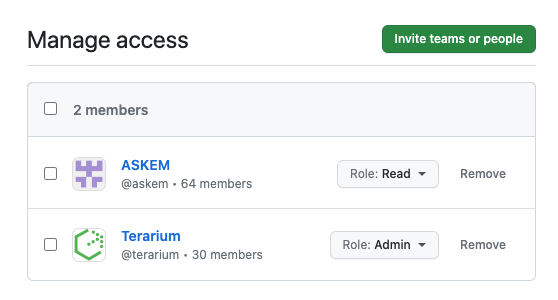

# Upload a package without a repository

Some packages are to be uploaded to our GitHub organization directly without a repository.
A decision was made to avoid bugs and issues with other packages manager to upload specific version of software _(i.e. PostGres 15.1)_.

## Steps
- Download [`regclient`](https://github.com/regclient/regclient/blob/main/docs/install.md#downloading-binaries) software. Select the `regctl-darwin-arm64` as we are switching to ARM architecture for developers.
- Check that your GitHub access tokens has `package:write` enable.
- Select on docker hub which image and version image you would like to use. 

    i.e. `RabbitMQ 3.11-alpine`
- Run the following command `regctl-darwin-arm64 image copy [IMAGE] ghcr.io/darpa-askem/[IMAGE]`

    ```shell
    $ regctl-darwin-arm64 image copy rabbitmq:3.11-alpine ghcr.io/darpa-askem/rabbitmq:3.11-alpine
    ```
- Check that the package has been properly uploaded to the [GitHub organization](https://github.com/orgs/DARPA-ASKEM/packages) and update the package settings to add the [`ASKEM`](https://github.com/orgs/DARPA-ASKEM/teams/askem) team as a read and [`Terarium`](https://github.com/orgs/DARPA-ASKEM/teams/terarium) as Admin, and remove yourself from the _Manage access_.
    
